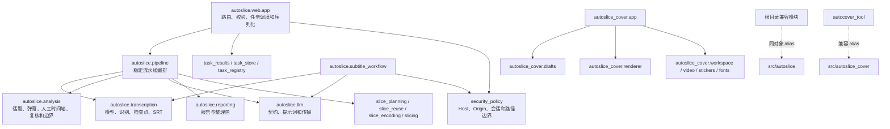

# 架构重构说明

本文面向 AutoSlice 维护者，记录当前 `main` 的真实分层、唯一实现 owner、兼容边界、任务状态与安全策略、自动验证证据以及仍待完成的工作。它不是日常使用教程；普通用户请参阅 [日常工作流](./日常工作流.md)，配置请参阅 [配置说明](./配置说明.md)，运行异常请参阅 [故障排查](./故障排查.md)。

本文中的“当前”以仓库内 `architecture_baseline.json` 和自动化门禁为准。历史提交或历史真实录播记录只能作为当时的检查点证据，不能代替后续修改完成后的最终重新验收。

## 1. 当前结论

AutoSlice 已从根目录单体脚本逐步迁移到 `src/autoslice` 和 `src/autoslice_cover`。当前架构具备以下性质：

- 本地 Python import 图没有依赖环；
- 没有重复的顶层函数或类定义；
- LLM、ASR、弹幕、人工时间轴、候选复核、标题、报告、切片和封面渲染均有唯一真实 owner；
- 根目录模块和历史包路径只保留同对象 alias、轻量参数适配或明确弃用入口；
- `analysis/candidates.py`、`transcription/service.py` 和多条历史分析路径已经收敛为兼容 façade，不再保存第二套业务实现；
- 主流水线和重试流程已按稳定阶段提取职责，剩余函数主要承担显式编排与结果解包；
- Web 任务使用持久化 `TaskStore` 和并发预约 `TaskRegistry`，任务摘要与完整产物分离；
- SSE 只发送脱敏后的结果路径，前端在同一受保护本机边界内按 task ID 读取完整结果；
- AutoCover 的真实实现只存在于 `src/autoslice_cover`，历史 `autocover_tool` 只承担兼容入口和用户本地数据发现；
- hermetic 测试默认阻断真实网络、付费 LLM、模型下载、GPU、Flask 监听和用户媒体副作用。

这不等于“长期重构和最终验收已经全部完成”。兼容表面、Web/字幕工作流、AutoCover 状态、配置依赖和安全清理已经完成本轮代码与自动化门禁；当前仍需完成指定真实录播的最终重新验收和公开仓库最终复核。不能因为历史真实验收曾通过，就宣称后续架构与任务状态修改已经完成最终真实验收。

## 2. 当前目录和依赖方向



依赖方向的硬规则：

1. 底层 `autoslice.*` 模块不得反向导入 `autoslice.web.app`、`autoslice.subtitle_workflow` 或 `autoslice.topic_engine`；
2. 生产消费者应直接依赖真实 owner，不通过根目录兼容模块间接调用；
3. 兼容模块只能重导出同一对象、做必要参数适配或给出明确弃用错误；
4. 新 owner 接入后必须删除旧真实实现，不允许“新模块已存在，但旧函数仍在后面覆盖”的双实现；
5. 不以文件行数作为唯一拆分标准，不创建只有参数搬运、没有独立领域契约的空阶段模块。

## 3. 当前唯一实现 owner

### 3.1 LLM

| 职责 | 唯一 owner | 边界 |
|---|---|---|
| 请求/响应契约与错误类型 | `autoslice/llm/contracts.py` | 定义 OpenAI/Anthropic 兼容调用所需的数据和错误语义 |
| 系统提示词和标题爆点指引 | `autoslice/llm/prompts.py` | 与 HTTP 传输解耦，可独立验证 |
| 协议、重试、503/限流分类、代理和凭据脱敏 | `autoslice/llm/transport.py` | `llm_client.py` 仅兼容重导出 |

Luna 负责首轮内容理解，Terra 负责候选价值、边界和标题复核。模型费用不能代替质量判断，但测试和普通架构重构不得发起真实付费请求。

### 3.2 转录与字幕基础能力

| 职责 | 唯一 owner |
|---|---|
| 模型发现、设备、热词、CAM++ 和运行时状态 | `autoslice/transcription/model_runtime.py` |
| 分块识别和缺失分块补跑 | `autoslice/transcription/recognition.py` |
| 检查点、输入指纹、原子提交和残缺 SRT 隔离 | `autoslice/transcription/checkpoints.py` |
| FunASR 结果归一化和主要说话人片段 | `autoslice/transcription/results.py` |
| 字幕段落、长度和时间范围处理 | `autoslice/transcription/segments.py` |
| SRT 读写、修复和校对字幕导出 | `autoslice/transcription/srt_io.py` |
| 完整 `ensure_srt` 编排 | `autoslice/transcription/workflow.py` |

`autoslice/transcription/service.py` 当前是同对象兼容 façade，不再拥有模型加载、识别或写 SRT 的第二套实现。正式 SRT 只有在全部必要分块成功并通过原子提交契约后才可复用。

### 3.3 话题、弹幕、人工时间轴和候选复核

| 职责 | 唯一 owner |
|---|---|
| 弹幕密度、语义互动、峰值证据和刷屏降权 | `autoslice/analysis/danmaku.py` |
| 首轮话题分块、分析、响应清洗和标题 | `autoslice/analysis/topic/` |
| 人工时间轴时基、候选、补充、复核和产物 | `autoslice/analysis/manual/` |
| 分块分析与候选复核检查点 | `autoslice/analysis/checkpoints.py` |
| 投稿价值提示、候选复核、评分和决策 | `autoslice/analysis/review/` |
| 上下文证据、SC/礼物触发、转场、收播、去重和最终化 | `autoslice/analysis/review/` |
| 单片和批量边界扩展编排 | `autoslice/analysis/boundaries.py` |

`autoslice/analysis/candidates.py` 当前没有顶层函数或类，它通过明确 alias 维持历史导入兼容。`manual_timeline.py`、`titles.py`、`clip_policy.py` 等短文件也属于兼容 façade；真实实现位于对应子包。

人工时间轴记录的是北京时间，程序会换算为视频内秒数，多段录播分别匹配。人工条目只提供候选和上下文证据，不会机械照抄为最终切片。

### 3.4 流水线、报告和切片

主流水线的阶段 owner 包括：

- `pipeline_transcription.py`：字幕准备；
- `pipeline_analysis.py`：弹幕和基础分析准备；
- `pipeline_manual.py`：人工时间轴；
- `pipeline_llm.py`：首轮 LLM 分块；
- `pipeline_review.py`：候选复核；
- `pipeline_titles.py`：投稿标题复核；
- `pipeline_decisions.py`：切片决策；
- `pipeline_boundaries.py`：边界准备；
- `pipeline_reporting.py`：报告数据；
- `pipeline_artifacts.py`：共同产物持久化。

重试流程的稳定 owner 包括：

- `pipeline_retry.py`：恢复状态；
- `pipeline_retry_analysis.py`：分析材料恢复；
- `pipeline_retry_review.py`：候选与标题复核；
- `pipeline_retry_decisions.py`：重试决策；
- `pipeline_retry_reporting.py`：报告和返回结果。

`pipeline.py` 仍保留公开 façade、主流程和重试流程的显式编排。当前没有引入统一 `PipelineStage` 类框架，因为各阶段已经有稳定函数契约，再增加一层对象框架目前只会搬运参数。

报告和切片 owner：

| 职责 | 唯一 owner |
|---|---|
| 概览、话题报告、精调清单和整理包 | `autoslice/reporting.py` |
| 切片计划 | `autoslice/slice_planning.py` |
| 已有媒体复用和标题重命名 | `autoslice/slice_reuse.py` |
| FFmpeg 编码参数和执行 | `autoslice/slice_encoding.py` |
| `slice_from_marks` 稳定编排 | `autoslice/slicing.py` |

结果数据和预览的边界另外保持独立：

| 职责 | 唯一 owner | 边界 |
|---|---|---|
| 结果质量概览 | `autoslice.analysis.quality_overview` | 只生成用于排序和选择的有界摘要；允许截断，不能作为完整时间轴数据源 |
| 完整时间轴契约和序列化 | `autoslice.timeline_contract` | 输出稳定 ID、数值时间、来源和 `complete`/`truncated` 完整性字段；不读取用户路径或媒体 |
| 任务级短片媒体 token、Range 和文件身份复核 | `autoslice.media_preview.MediaPreviewOwner` | 只消费已登记且属于当前任务的短片，不接受请求方任意 `path`，不提供整场源视频 |

`quality_overview` 可以被任务摘要消费，但其 `MAX_OVERVIEW_BYTES`、候选条数和字段裁剪规则
意味着它不是完整时间轴数据源。完整时间轴由 `autoslice.timeline_contract` 和任务级读取
入口负责；媒体播放由 `autoslice.media_preview` 单独负责。三者不得互相复制实现或通过
内部绝对路径绕过任务归属和安全边界。

JSON 切片契约保留 `start`、`end`、`topic_start`、`topic_end` 和 `time_basis`，不会把显式结束时间退化成固定前后扩展。正确成片可在续跑时直接复用；只修改标题时可以重命名，不应重新编码。

### 3.5 Web、任务和安全

| 职责 | 唯一 owner |
|---|---|
| 紧凑任务结果构造与路径字段约束 | `autoslice/task_results.py` |
| SQLite 任务和结果持久化 | `autoslice/task_store.py` |
| 原子任务预约、冲突和取消 Event 生命周期 | `autoslice/task_registry.py` |
| Flask 路由、后台线程、SSE 和前端入口 | `autoslice/web/app.py` |
| Host、Origin、会话、LAN 令牌和路径根 | `autoslice/security_policy.py` |

`TaskStore` 不保存完整字幕、完整报告、全部话题或全部 `clip_marks`。它只保存状态和紧凑摘要；完整数据保存在报告、JSON、字幕、检查点和整理包中。

SSE 为避免向浏览器事件流泄露本机目录，会递归把绝对路径转换为文件名或目录末段。任务完成后，官方前端通过受同一 loopback/会话安全边界保护的 `GET /api/tasks/<task_id>/result` 读取完整本机结果，用于打开报告和结果目录。SSE 的兼容字段名保留，但不再承担完整结果传输。

完成、失败、取消和兼容删除后，`TaskRegistry` 会释放不再需要的取消 Event；取消时会先通知仍持有 Event 的 worker，避免任务泄漏或重复取消重新创建对象。

### 3.6 AutoCover

`src/autoslice_cover` 是唯一真实 owner：

- `app.py`：Web API 和工作区调度；
- `drafts.py`：磁盘草稿、版本和最后成功预览；
- `workspace.py`：任务、输出和缓存；
- `renderer.py`：Pillow 封面渲染；
- `video.py`：媒体探测、选帧和重切；
- `fonts.py`、`emoji.py`、`stickers.py`：字体、Windows Emoji 和贴图；
- `style.py`、`titles.py`：样式和文案；
- `paths.py`：安装态和源码态资源路径。

`autocover_tool` 只保留历史导入、启动入口和本地数据发现，不得新增第二套渲染、草稿或工作区逻辑。

AutoCover 编辑状态的恢复优先级是：

```text
当前页面内存
→ 服务端磁盘草稿
→ localStorage 浏览器崩溃恢复缓存
→ sessionStorage 当前标签页活动任务
```

磁盘草稿记录源视频身份、设置、客户端 revision、`updated_at`、选中帧和与设置指纹匹配的最后成功预览。预览缓存不是编辑状态的权威来源；设置指纹不匹配、版本较旧或来自较早并发请求的预览不得覆盖当前状态。

## 4. 当前架构指标

指标由 `scripts/architecture_snapshot.py` 从受控源码范围生成。该脚本不读取 API 配置、模型、用户媒体、字幕、时间轴、字体、贴图或草稿。

| 指标 | 重构起点 | 当前快照 | 说明 |
|---|---:|---:|---|
| 生产 Python 模块 | 31 | 179 | 真实 owner、兼容层、AutoCover 和发布脚本均显式计入 |
| 生产源码行数 | 25,905 | 44,357 | 新增功能、契约、安全和测试入口使总量增加，不能单独代表债务 |
| 顶层函数 | 未建立统一基线 | 1,040 | 包含公开入口、内部 owner 和发布脚本 |
| 顶层类 | 未建立统一基线 | 110 | 主要是配置、任务、结果、工作区和安全模型 |
| 本地 import 边 | 41 | 478 | 分层更显式，由无环护栏约束 |
| 依赖环 | 1 | 0 | 禁止底层反向依赖高层入口 |
| 重复顶层定义 | 未设护栏 | 0 | 防止导入新模块后又被旧实现覆盖 |
| 测试对私有符号的 patch | 138 | 17 | 私有 patch 只允许在有明确兼容理由的测试 seam 中保留 |

本表的“当前快照”于 2026-08-27 按仓库当前提交运行
`python -B scripts/architecture_snapshot.py` 生成；`architecture_baseline.json` 是该脚本的
受控输出，不能手工编辑。数字是审阅快照，不是永久事实、质量目标或 Action 完成条件；
后续 Action 修改代码后必须重新生成并检查，不能直接套用本表的行号、数量或函数长度。

当前主要模块和最长函数：

| 模块 | 行数 | 最长函数 |
|---|---:|---:|
| `src/autoslice/analysis/candidates.py` | 569 | 无顶层函数；兼容 façade |
| `src/autoslice/analysis/boundaries.py` | 454 | `_expand_clip_mark_with_context`，267 行 |
| `src/autoslice/analysis/topic/analysis.py` | 801 | `analyze_topic_chunks`，313 行 |
| `src/autoslice/analysis/review/workflow.py` | 338 | `review_peak_selected_topics`，135 行 |
| `src/autoslice/analysis/review/decisions.py` | 556 | `apply_danmaku_slice_decisions`，148 行 |
| `src/autoslice/subtitle_workflow.py` | 2,417 | `suggest_subtitle_corrections`，151 行 |
| `src/autoslice/web/app.py` | 3,019 | `update_task`，133 行 |
| `src/autoslice/transcription/service.py` | 105 | 无顶层真实函数；兼容 façade |
| `src/autoslice/transcription/workflow.py` | 464 | `ensure_srt`，183 行 |
| `src/autoslice/pipeline.py` | 1,115 | `run_pipeline_impl`，307 行 |
| `src/autoslice/pipeline.py` 重试入口 | 同上 | `retry_clip_review_from_artifacts_impl`，244 行 |
| `src/autoslice/reporting.py` | 1,265 | `organize_existing_artifacts`，187 行 |
| `src/autoslice/analysis/topic/titles.py` | 1,087 | `review_selected_publish_titles`，117 行 |
| `src/autoslice/slicing.py` | 221 | `slice_from_marks_impl`，135 行 |
| `src/autoslice/topic_engine.py` | 798 | `main`，25 行；其余为兼容绑定 |
| `src/autoslice/core.py` | 81 | `parse_timeline_json`，35 行 |
| `src/autoslice_cover/app.py` | 1,111 | `create_app`，481 行 |
| `src/autoslice_cover/renderer.py` | 1,259 | `render_cover`，148 行 |

`create_app`、主流水线和候选复核仍值得持续审计，但“函数较长”本身不证明应立即提取。下一步必须先识别独立输入、输出、副作用和生产消费者。

## 5. 兼容层边界

### 根目录模块

根目录 `app.py`、`topic_engine.py`、`artifact_store.py`、`llm_client.py`、`runtime_config.py`、`task_store.py`、`task_registry.py`、`media_formats.py`、`security_policy.py` 和 `streamer_profiles.py` 使用统一兼容 alias，把旧模块名绑定到 `src/autoslice` 的同一模块对象。

`core.py` 只保留原子转录转发、旧 JSON 标记解析和对退役 `process_video()` 的明确错误。产品入口不再运行旧弹幕、DOCX、边界或 FFmpeg 流水线。

### `autoslice.topic_engine`

`autoslice.topic_engine` 继续维护历史公开和私有符号的对象身份，供旧脚本、测试和渐进迁移使用。新增生产代码不得继续扩大它的表面，也不得在其中放回已经迁出的业务实现。

### `autoslice.analysis.candidates`

`analysis.candidates` 只聚合历史符号到 `analysis.topic`、`analysis.manual`、`analysis.review`、`analysis.danmaku`、`analysis.boundaries`、`transcription` 和 `llm.transport`。它没有自己的顶层业务函数或类。

### `autocover_tool`

历史 `autocover_tool` 路径通过兼容 alias 指向 `autoslice_cover`。用户本地草稿、字体、贴图和配置属于运行数据，不是第二套源码实现。

## 6. 自动切片业务契约

架构重构必须保持以下行为：

- 不按每小时固定数量凑切片，没有高价值候选时允许少切或不切；
- 弹幕峰值只发现候选，AI 仍需核对字幕、互动语义、前因后果和投稿价值；
- 普通星标不机械加分，只有星标显著集中时才酌情增权；
- 无意义刷屏、重复字符和单纯问号刷屏不会直接成为高价值候选；
- 人工时间轴只提供参考，不机械生成最终切片；
- SC、礼物或明显互动触发的话题尽量保留真实起点；
- 片段保留诱因、冲突、爆点、结果和自然收尾；
- 片段不重复、不无意义重叠，也不会为满足数量混入低价值内容；
- “晚安小音音”等收播系列从真实收播话术开始，保留到视频实际结束；
- 标题读取真实字幕和上下文，突出诱因、反转、代价、结果或记忆点原话；
- 标题主播前缀根据录播文件名、路径和主播 profile 识别，禁止硬编码单一主播；
- 原始自动切片不包含字幕流。用户精剪完成后，再在字幕工作台识别、校对并压制字幕。

## 7. 任务结果、SSE 和产物

流水线的完整结果可能包含大量话题、候选、报告和字幕数据，不适合写入任务数据库或通过 SSE 反复广播。当前分层为：

1. `TaskStore` 保存状态、进度、紧凑结果摘要和恢复所需元数据；
2. 报告、`clip_marks.json`、字幕、检查点和视频文件写入整理包与切片目录；
3. SSE 发送任务状态和脱敏后的路径摘要；
4. 官方前端在任务终态后使用 task ID 读取完整结果；
5. 跨进程或历史查看以磁盘产物为权威，不依赖无限增长的内存事件历史。

紧凑摘要至少能表达话题数量、切片数量、失败分块数量、warning 和主要产物位置，但不得重新塞入完整报告、全部话题、全部切片标记或字幕正文。任务状态写入异常也不能把已经成功生成全部产物的业务流水线误报成“完整分析失败”。

## 8. 自动护栏和运行安全

### 架构护栏

`tests/architecture/test_architecture_contracts.py` 和 `architecture_baseline.json` 检查：

- import 图无环；
- 底层模块不反向依赖高层入口；
- 顶层函数和类没有重复定义；
- façade 重导出与真实 owner 保持对象身份；
- private patch 数量不超过允许基线；
- 快照与当前源码一致。

### Hermetic 护栏

`tests/support/external_boundary_guard.py` 与 hermetic runner 默认阻断：

- 未 mock 的 HTTP、URL、socket 和真实 LLM；
- FunASR、ModelScope、Hugging Face 下载和真实 torch 加载；
- `pip` 安装、Flask 服务和 5002/5010 端口监听；
- 未批准目录中的媒体、字幕、时间轴、模型、字体和贴图访问；
- 携带真实媒体路径的原生媒体子进程。

真实流水线只能通过明确的人工冒烟入口和显式授权参数执行。长录播验收不得执行整场字幕压制或整场重编码。

### Web 安全

- 默认只监听 loopback；
- 写接口校验 Host、Origin/Referer 和会话；
- LAN 模式必须显式开启并配置强令牌、允许 Host/Origin 和路径根；
- 用户路径必须落在配置允许的输入、输出和工作区范围；
- LLM `direct` 模式不继承系统代理，`system` 和 `custom` 模式必须显式选择；
- 配置、异常、SSE 和公开发布扫描会脱敏凭据与本机路径。

## 9. 当前自动验证证据

验证证据不再在本文硬编码测试数量，而按来源解释：

| 证据 | 权威来源 | 语义 |
|---|---|---|
| 依赖环、重复顶层定义、owner 结构和 private patch 上限 | `architecture_baseline.json` 与 `tests/architecture/test_architecture_contracts.py` | 当前仓库快照和架构护栏；代码变化后必须重新生成/检查 |
| Windows hermetic 测试 | `.github/workflows/tests.yml` 的 Windows job 与当前提交对应 CI | 覆盖项目定义的完整隔离测试；不等于真实用户媒体验收 |
| Linux logic-only 测试 | `.github/workflows/tests.yml` 的 Linux job 与当前提交对应 CI | 只覆盖不依赖真实模型、FFmpeg、字体、浏览器和用户媒体的逻辑白名单 |
| 公开文档、发布扫描和公开编译 | `scripts/validate_public_docs.py`、`scripts/scan_public_release.py`、`scripts/compile_public.py` | 当前提交的治理门禁，不是永久文件数量 |

测试数量、公开文件数量、函数行数、CI run ID 和文件行号都是对应提交的审阅快照，
不应手工写成永久常量，也不能用历史 CI 替代当前提交证据。Windows 的 hermetic 测试
和 Ubuntu 的逻辑测试都不等于真实用户媒体验收；Linux 逻辑测试通过不代表 Linux 已
支持完整 GPU、字幕压制和媒体工作流。当前完整主平台仍是 Windows 10/11，macOS 未验证。

两项跳过必须是明确依赖可选环境的测试，不能静默跳过核心业务逻辑。每个 Action 的
完成证据必须引用对应提交的实际 CI 和本地命令输出；本文只说明证据类型，不复制易漂移的数量。

## 10. 历史真实录播记录和最终验收边界

历史检查点曾使用一段真实长录播完成以下有限验证：

- CUDA FunASR 分块转录；
- 弹幕证据；
- 北京时间人工时间轴匹配；
- Luna/Terra 分析和复核；
- 语义边界修复；
- FFmpeg 输出 H.264/AAC 成片；
- 原始自动切片无字幕流；
- 重复续跑复用正确媒体。

该历史记录证明当时的关键媒体链路可工作，也曾发现并修复收尾遗漏问题。但在它之后，任务摘要、SSE、任务生命周期、边界 owner 和其他架构代码仍有修改。因此它不能作为当前长期目标的最终验收结论。

本轮架构、兼容、安全、清理和公开文档 Action 完成后，仍必须重新执行用户指定的有限真实录播验收：长录播只验证字幕读取或必要转录、弹幕、LLM、人工时间轴、候选、边界、报告、检查点、切片和续跑；字幕识别、校对和压制只对最终短片或代表性短样本执行，严禁对数小时录播做整场字幕压制。

## 11. 剩余技术债务和后续顺序

当前剩余工作按风险和依赖顺序处理：

1. **最终真实验收。** 重新验证指定长录播、最终短片字幕和重复续跑幂等性。
2. **最终发布复核。** 从干净 clone 验证文档、配置示例、启动入口、wheel、敏感信息和 GitHub 文件树。

主流水线与 retry、兼容 façade、字幕/Web、AutoCover 状态、配置依赖、媒体格式、错误提示和安全清理已经完成本轮证据审计。后续只有出现新的失败反例或维护证据时才继续拆分，不以行数本身为目标。

后续拆分继续遵守：一次一个 owner、契约先行、删除旧实现、保留轻量 façade、定向测试后跑完整门禁、每个 Action 独立提交并等待 Windows/Linux CI 双绿。

## 12. 完整复核命令

普通架构和文档 Action 至少运行：

```powershell
python -B scripts\validate_public_docs.py
python -B scripts\compile_public.py
python -B scripts\architecture_snapshot.py --check
python -B scripts\run_hermetic_tests.py -q
python -B scripts\run_linux_logic_tests.py -q
python -B scripts\smoke_packaging.py
python -B scripts\verify_distribution.py
node --check src\autoslice_cover\resources\static\app.js
python -B -m compileall -q src tests
git diff --check
```

涉及发布内容时，还必须在不包含本地未跟踪文件的 clean staging 中运行：

```powershell
python -B scripts\scan_public_release.py
```

涉及 Python 源码时使用 Ruff 做增量比较；不得为了清零既有告警而无关格式化。涉及前端时增加 JavaScript、API、草稿恢复和必要的桌面浏览器验证。涉及真实媒体时只能使用明确授权的人工冒烟脚本，并在结束后确认没有遗留服务或媒体进程。

`architecture_baseline.json` 必须由脚本生成，不能手工修改指标绕过架构契约。
