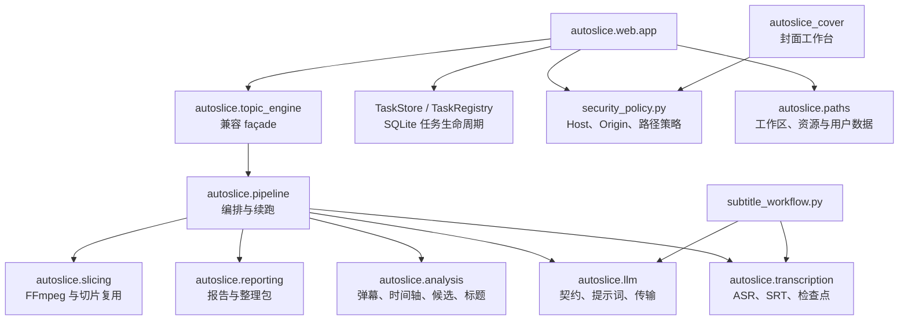

# 架构重构说明

本文面向 AutoSlice 的维护者，说明当前代码的真实分层、兼容边界、验证证据和仍需偿还的技术债务。它是架构状态说明，不是用户操作教程；日常使用请参阅 [日常工作流](./日常工作流.md)，配置请参阅 [配置说明](./配置说明.md)。

## 1. 重构结论

本轮采用渐进迁移，而不是一次性重写。原先集中在 `topic_engine.py` 和 `core.py` 中的 ASR、弹幕、LLM、人工时间轴、候选边界、标题、报告、切片与任务状态已迁移到有明确 owner 的模块；旧导入路径继续以兼容 façade 或弃用 shim 存在。

截至当前架构快照：

- 本地模块 import 图没有循环依赖；
- 没有重复的顶层函数或类定义；
- LLM、ASR、弹幕、报告和 FFmpeg 切片均只有一个实现 owner；
- `src/autoslice/topic_engine.py` 从业务单体收敛为 695 行兼容 façade，仅保留对象绑定和 22 行兼容 CLI；
- `core.py` 从第二套切片实现收敛为 81 行弃用 shim；
- Flask 后台任务由统一的 SQLite `TaskStore`/`TaskRegistry` 管理；
- 自动测试默认阻断真实网络、模型下载、服务端口和用户媒体访问；
- 真实录播验收已覆盖一次 CUDA ASR、弹幕、北京时间人工时间轴、Luna/Terra 分析、边界修复、FFmpeg 成片和重复续跑。

这不等于“技术债务清零”。`src/autoslice/analysis/candidates.py`、`src/autoslice/pipeline.py` 和 `src/autoslice/transcription/service.py` 仍偏大，最长函数仍有 415 行；这些是后续小步拆分对象，不应再次采用整文件重写。

仓库现在通过 `pyproject.toml` 声明 editable/wheel 安装、统一依赖和 `autoslice`
命令，并保留 `python 启动.py`。AutoSlice 与 AutoCover 的 owner、Flask 模板和
静态资源已经分别迁入 `src/autoslice`、`src/autoslice_cover`。发布门禁会在临时
Python 3.10 环境构建 wheel，并从仓库外验证两个 CLI、包资源和只读安装边界。

## 2. 当前模块关系



依赖方向的核心规则是：`autoslice.*` 底层模块不得反向导入 `autoslice.web.app`、`autoslice.subtitle_workflow` 或 `autoslice.topic_engine`。根目录兼容模块只把旧名称绑定到 `src/autoslice` 中的同一模块对象；新脚本应直接依赖 `autoslice.pipeline`、`autoslice.slicing` 等 owner。

## 3. 唯一实现 owner

| 能力 | 当前 owner | 说明 |
|---|---|---|
| LLM 配置、协议、重试和代理 | `autoslice/llm/contracts.py`、`autoslice/llm/transport.py` | OpenAI/Anthropic 兼容协议共用传输层；`llm_client.py` 仅兼容重导出 |
| 业务提示词 | `autoslice/llm/prompts.py` | 与 HTTP 传输分离，可独立做契约测试 |
| FunASR、SRT 和检查点 | `autoslice/transcription/service.py` | 分块失败不会留下可复用的残缺正式 SRT |
| 弹幕解析与峰值证据 | `autoslice/analysis/danmaku.py` | 峰值只发现候选；问号、复读和泛刷屏会降权 |
| 北京时间人工时间轴 | `autoslice/analysis/timeline.py` | 按录播开播时间换算视频秒数，多段录播分别过滤 |
| 人工时间轴优化 | `autoslice/analysis/manual_timeline.py` | 生成分块参考、转换优化候选，并只重试低权重或未完成条目 |
| 分块分析与候选复核检查点 | `autoslice/analysis/checkpoints.py` | 原子保存首轮响应和复核状态，统一版本、主播匹配与续跑完成判定 |
| 候选发现与价值复核 | `autoslice/analysis/candidates.py` | 负责首轮话题、弹幕峰值候选、投稿价值和独立 AI 复核 |
| 切片策略与语义边界 | `autoslice/analysis/clip_policy.py`、`autoslice/analysis/boundaries.py` | 统一评分阈值、SC 前因、上下文、自然收尾、收播与非重叠合并 |
| 投稿标题 | `autoslice/analysis/titles.py` | 读取原字幕和弹幕证据，按主播 profile 生成并复核 |
| 流水线与检查点续跑 | `autoslice/pipeline.py` | 只编排各 owner，不重新实现媒体或 LLM 传输 |
| 报告和整理包 | `autoslice/reporting.py` | 生成概览、话题分析、精调任务和相对链接 |
| FFmpeg 切片 | `autoslice/slicing.py` | 保留 `start/end/time_basis`，按源容器选择输出并复用已有成片 |
| 任务持久化 | `task_store.py`、`task_registry.py` | SQLite 保存状态、结果、资源和重启后的 `interrupted` 状态 |
| 本地 Web 安全 | `security_policy.py` | loopback Host/Origin、会话、LAN 模式令牌和路径根约束 |
| 工作区、包资源与可写状态路径 | `src/autoslice/paths.py`、`src/autoslice_cover/paths.py` | 源码态兼容仓库目录，安装态写入用户数据目录，不依赖当前工作目录 |

## 4. 兼容层的边界

### `topic_engine.py`

旧代码仍可从根目录 `topic_engine` 导入公开符号，该 shim 会绑定到 `autoslice.topic_engine` 的同一个模块对象。包内 façade 的符号直接绑定到 owner，并由身份测试保证不会在文件后部出现第二套同名实现。它目前仍有较多兼容重导出和一个 22 行命令入口，所以 695 行不能理解为理想的最终公开 API；新增代码不应继续扩大该表面。

### `core.py`

只保留三类兼容行为：原子 ASR 转发、旧 JSON 标记解析，以及对已退役 `process_video()` 的明确报错。产品入口不再依赖它，也不会再运行旧弹幕、DOCX、边界或 FFmpeg 流水线。

### `llm_client.py`

只兼容重导出 `autoslice.llm.transport` 中的对象。代理模式、协议适配、503/限流分类、推理强度和凭据脱敏均在唯一 transport 中实现。

## 5. 架构指标

指标由 `scripts/architecture_snapshot.py` 从 AST 和源码文本生成，不读取 API 配置、模型、录播、字幕、时间轴、字体或贴图。

| 指标 | 重构起点 | 当前快照 | 解读 |
|---|---:|---:|---|
| 产品 Python 模块 | 31 | 93 | AutoSlice/AutoCover 均有显式 `src` owner，旧入口拆成无业务实现的兼容 alias |
| 产品源码行数 | 25,905 | 33,818 | 增长来自新增契约、安全、功能和安装验证；不能把总行数当作单一质量指标 |
| 本地 import 边 | 41 | 169 | 两个生产包的分层与兼容边界更显式，架构测试保证方向和无环 |
| 依赖环 | 1 | 0 | `topic_engine` 与字幕工作流的循环已消除 |
| 重复顶层定义 | 0 | 0 | 防止“新模块已导入、旧实现又在后面覆盖” |
| 测试对私有符号的 patch | 138 | 17 | 降低约 88%，测试优先走稳定 seam |
| `topic_engine.py` | 12,337 行 | 703 行 | 缩减约 94%，现为兼容 façade 与薄 CLI |
| `core.py` | 652 行 | 81 行 | 第二套旧流水线已退役 |
| 当前最长函数 | 415 行 | 415 行 | 已迁至 `autoslice.pipeline`，但仍需后续拆分 |

当前主要模块大小：

| 模块 | 行数 | 最长函数 |
|---|---:|---:|
| `src/autoslice/analysis/candidates.py` | 3,495 | 247 |
| `src/autoslice/analysis/boundaries.py` | 1,752 | 264 |
| `src/autoslice/analysis/manual_timeline.py` | 309 | 61 |
| `src/autoslice/analysis/checkpoints.py` | 247 | 32 |
| `src/autoslice/subtitle_workflow.py` | 2,366 | 151 |
| `src/autoslice/web/app.py` | 2,208 | 137 |
| `src/autoslice/transcription/service.py` | 1,937 | 364 |
| `src/autoslice/pipeline.py` | 1,466 | 415 |
| `src/autoslice/reporting.py` | 1,091 | 183 |
| `src/autoslice/analysis/titles.py` | 1,086 | 117 |
| `src/autoslice_cover/renderer.py` | 1,245 | 146 |
| `src/autoslice_cover/app.py` | 984 | 408 |
| `src/autoslice/llm/transport.py` | 915 | 124 |
| `src/autoslice/topic_engine.py` | 703 | 22 |
| `src/autoslice/slicing.py` | 637 | 292 |
| `src/autoslice/core.py` | 81 | 35 |

## 6. 自动护栏与运行安全

### 架构护栏

`tests/architecture/test_architecture_contracts.py` 会检查：

- import 图无环；
- 底层模块不反向依赖 Web 或兼容 façade；
- 顶层函数和类没有重复定义；
- façade 重导出与唯一 owner 保持对象身份；
- 架构快照与源码一致。

AutoSlice 与 AutoCover 测试统一按职责存放：`tests/unit/` 是可隔离服务、
封面渲染与纯逻辑测试，`tests/integration/` 覆盖 Flask、启动器、字幕、封面
工作流和完整话题流水线，`tests/architecture/` 固定依赖方向、兼容身份与
外部边界，`tests/support/` 只保存测试运行器和用例共用的护栏。统一
hermetic runner 只从 `tests/` 发现用例，避免旧兼容目录被误当成测试 owner。

### 外部副作用护栏

`tests/support/external_boundary_guard.py` 与 hermetic runner 默认阻断：

- 未 mock 的 HTTP、URL、socket 和真实 LLM 请求；
- FunASR/ModelScope/Hugging Face 下载和真实 torch 加载；
- `pip` 安装、Flask 真实启动和 5002/5010 端口绑定；
- 未批准目录中的媒体、字幕、时间轴、模型、字体和贴图访问；
- 携带真实媒体路径的原生子进程调用。

真实流水线只能通过 `scripts/manual/run_real_pipeline_smoke.py` 显式执行：默认仅 dry-run；`--allow-asr`、`--allow-paid-llm` 和 `--allow-ffmpeg` 分别授权模型、付费分析和成片。已存在输出必须带归属标记且输入指纹完全匹配才能续跑。

### Web 与任务安全

- 默认只监听 loopback；
- 写接口校验精确 Host、Origin/Referer 和内存会话；
- LAN 模式必须显式开启，并配置强令牌、允许 Host/Origin 和路径根；
- 任务、事件和结果持久化到 SQLite，历史有 TTL/数量上限；
- LLM `direct` 模式不继承系统代理，`system` 和 `custom` 模式必须显式选择；
- 配置、异常和测试输出会脱敏代理及认证凭据。

## 7. 已完成的验证

### 自动回归

最终 hermetic 回归：

```text
Ran 772 tests
OK (skipped=2)
state_before=False
state_after=False
```

两项跳过是明确依赖可选环境的测试，不会静默跳过核心逻辑。Windows 运行完整测试；Ubuntu CI 只运行不依赖模型、FFmpeg、字体和用户媒体的纯逻辑白名单，不能据此宣称 Linux 支持完整媒体工作流。macOS 尚未验证。

### 真实录播验收

用户指定的 2026-08-15 歌回第 001 分段完成了以下流程：

1. Fun-ASR-Nano-2512 在 CUDA 上完成 10/10 分块并写入完整检查点；
2. 对应 ASS 成功生成弹幕密度和内容证据；
3. 整场 40 条北京时间轴只映射 1 条到当前录播分段；
4. Luna/Terra 生成 6 个报告话题，高弹幕但只有泛问候的峰值被拒绝；
5. 最终只保留 1 个投稿候选，没有按时长或每小时数量硬凑；
6. 真实回归发现原 `796–976s` 漏掉延迟收尾，语义边界修复后为 `796–997s`；
7. `991–996s` 的“低血糖/眩晕”结论被保留，约 `1001.7s` 开始的下一条 SC 未混入；
8. FFmpeg 输出 1 个 `201.067s` FLV，仅含 H.264/AAC，无字幕流；
9. 同参数续跑仍只有 1 个文件，大小、修改时间和 SHA-256 不变；标题变化时复用已有媒体并只重命名。

该验收只覆盖一场直播的第一分段，不等于所有主播、所有容器或同场六个分段都已做真实媒体验收。

## 8. 剩余技术债务

按风险和收益排序：

1. **候选模块仍偏大。** `candidates.py` 有 3,495 行，首轮分块分析、候选清洗和价值复核仍可按稳定数据契约继续拆分；边界、策略、检查点与人工时间轴优化已经各有唯一 owner。
2. **编排函数仍过长。** `run_pipeline_impl()` 为 403 行，`retry_clip_review_from_artifacts_impl()` 为 415 行；应先抽取纯阶段函数和结果模型，再缩短编排。
3. **ASR owner 仍承担较多职责。** `ensure_srt()` 为 364 行，可把模型装载、分块执行、结果提交拆成内部服务，但必须保持原子 SRT 契约。
4. **切片 owner 的单函数偏长。** `slice_from_marks_impl()` 为 292 行，可分离计划、复用判定和 FFmpeg 执行。
5. **兼容 façade 表面仍大。** `topic_engine.py` 虽无第二套实现，但保留大量私有别名供旧测试和调用方过渡；只有确认无调用后才能逐批删除。
6. **历史 lint 债务仍存在。** 仓库范围的 Ruff `F/I` 仍会看到部分兼容重导出和导入排序告警；不能为了清零数字误删 façade API 或一次性格式化大型文件。
7. **平台覆盖有限。** Windows 10/11 是完整主平台；Linux 仅有纯逻辑 CI，macOS 未验证，Windows CUDA/剪映/字体和真实媒体能力不能外推。
8. **真实样本覆盖仍有限。** 当前只完整验收了一个第一分段；后续应逐步增加不同主播、长时长、多分段和非 FLV 容器的人工验收记录。

## 9. 后续拆分规则

继续重构时必须遵守：

1. 一次只迁移一个明确 owner；
2. 先冻结输入/输出契约和失败行为，再移动实现；
3. 新模块接入后必须删除旧实现，不能保留双实现；
4. façade 只做对象绑定和兼容，不加入新业务逻辑；
5. 每个提交都运行定向测试、架构快照和 `git diff --check`；
6. 每个阶段运行完整 hermetic 回归；
7. 真实 LLM、FunASR 和 FFmpeg 必须使用显式授权的人工冒烟入口；
8. 不把测试通过误写成“所有真实录播均无问题”。

## 10. 复核命令

```powershell
python -B scripts\architecture_snapshot.py
python -B scripts\architecture_snapshot.py --check
python -B scripts\run_hermetic_tests.py -q
python -B scripts\compile_public.py
node --check src\autoslice_cover\resources\static\app.js
python -B scripts\scan_public_release.py
python -B scripts\validate_public_docs.py
git diff --check
```

`architecture_baseline.json` 必须由脚本生成，不能手工修改指标来绕过架构契约。
